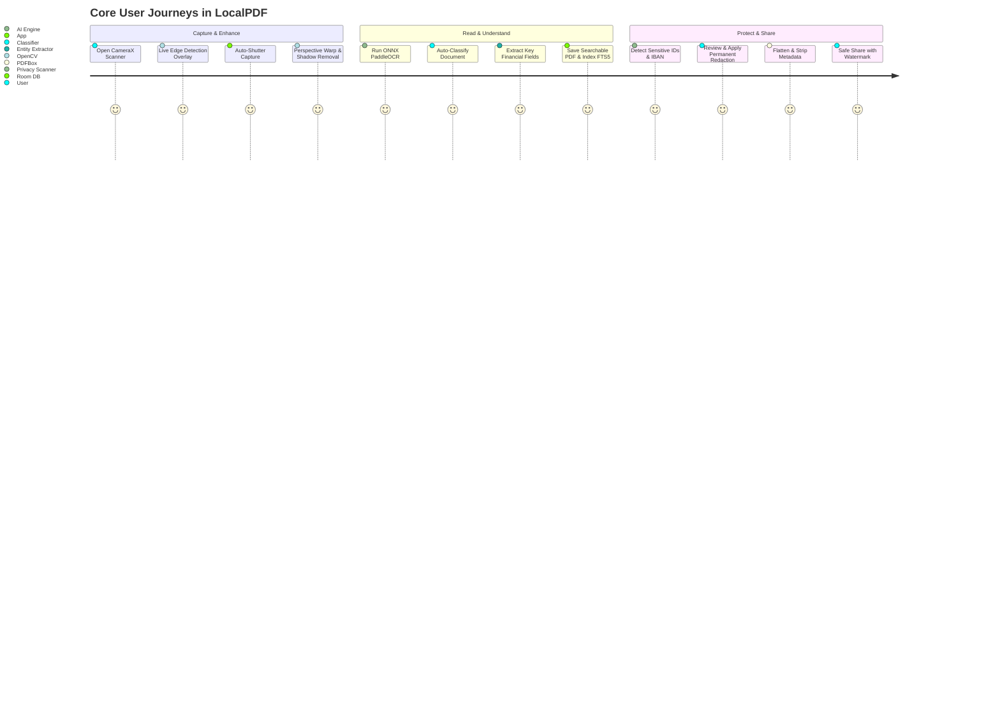

<div align="center">

# 📄 LocalPDF — Private Document AI

### *Scan, understand, search, protect, and act on your documents with 100% on-device privacy.*

[](https://kotlinlang.org/)
[](https://developer.android.com/jetpack/compose)
[](https://onnxruntime.ai/)
[](https://opencv.org/)
[](https://sqlite.org/fts5.html)
[](#-security--privacy-architecture)

<p align="center">
  <a href="#-problem-vs-solution">Problem & Solution</a> •
  <a href="#-core-feature-suite">Feature Suite</a> •
  <a href="#-interactive-ux--user-journeys">UX & Interactions</a> •
  <a href="#-technical-architecture">Architecture</a> •
  <a href="#-security--privacy-architecture">Security & Privacy</a> •
  <a href="#-project-structure">Project Structure</a> •
  <a href="#-developer-quickstart">Quickstart</a>
</p>

</div>

---

## 🎯 Problem vs. Solution

| ❌ The Status Quo (Traditional Cloud Scanners) | ✅ The LocalPDF Solution (Private Document AI) |
|---|---|
| **Privacy Surveillance**: Scanned tax records, passports, and medical files uploaded to remote servers for OCR and AI analysis. | **100% On-Device AI**: Quantized neural networks (PaddleOCR & ONNX) run locally on device CPU/NPU with **zero cloud egress**. |
| **Dumb Static Images**: Scans remain inaccessible bitmaps buried in gallery folders with no structured understanding. | **Automatic Intelligence**: Automatically classifies document types (Invoices, IDs, Bills, Contracts) and extracts financial totals, dates, and line items. |
| **Unreliable Keyword Search**: Finding a receipt from 6 months ago requires manually scrolling through hundreds of image thumbnails. | **Instant SQLite FTS5 Search**: Sub-30ms offline full-text search across all extracted text, tags, and amounts with highlighted snippets. |
| **Fake Redactions**: Black boxes drawn over text that can still be highlighted, copied, or uncovered from underlying PDF streams. | **Verifiable Permanent Redaction**: Irreversible pixel-burning and vector/text stream destruction with metadata & EXIF stripping. |
| **Aggressive Subscriptions & Ad Bloat**: Basic PDF features locked behind predatory monthly subscriptions and invasive ad SDKs. | **Zero Trackers, Zero Telemetry**: Clean enterprise architecture, modular Kotlin codebase, and complete data ownership. |

---

## ⚡ Core Feature Suite

### 1. 📸 Smart Document Scanner
* **Live Edge Detection**: Real-time OpenCV contour analysis dynamically detects document boundaries in the CameraX viewfinder.
* **Auto-Shutter Capture**: Automatically triggers a haptic snap when the camera holds steady over high-confidence corners.
* **Hardware-Accelerated Enhancement**: Automatic perspective rectification, deskewing, page dewarping, shadow removal, and contrast enhancement.
* **Scan Modes**: Color Enhanced, Grayscale, Pure Black & White (adaptive thresholding), and Original.
* **Multi-Page Batch Scanning**: Continuous multi-page scan tray with drag-and-drop reordering and blur detection alerts.

### 2. 🧠 On-Device OCR & Intelligence
* **Quantized PaddleOCR Pipeline**: Local text detection (`DBNet`) and text recognition (`CRNN/SVTR`) via ONNX Runtime Mobile.
* **Interactive OCR Correction Studio**: Side-by-side synchronized view with a zoomable original image crop beside an editable text field for fast correction.
* **Character Confusion Assistant**: Context-aware suggestions for confusing pairs (`0/O`, `1/I/l`, `5/S`).
* **Searchable PDF Generation**: Embeds an invisible, selectable OCR text layer directly over high-resolution page bitmaps.

### 3. 🏷️ Automatic Classification & Field Extraction
* **Zero-Shot Document Classifier**: Instantly identifies document types:
  * Invoices & Receipts • Utility Bills • Bank Statements • Contracts & Agreements • National IDs & Passports • Business Cards • Medical Reports • Tax Forms
* **Structured Field Extractor**: Automatically captures:
  * **Invoices/Bills**: Vendor, Invoice #, Due Date, Subtotal, Tax, Total Amount, Currency, Payment Details.
  * **Contracts**: Parties, Effective Date, Expiration Date, Renewal Clauses, Notice Periods.
  * **IDs**: Full Name, ID Number, Date of Birth, Expiry Date, Address, Nationality.
* **Smart Filenames**: Automatically generates semantic file names (e.g., `LESCO_Bill_August_2026.pdf` or `AcmeCorp_Invoice_INV-4231.pdf`).

### 4. 🔍 Intelligent Full-Text Search
* **SQLite FTS5 Full-Text Indexing**: Real-time phrase matching, token ranking, and highlighted match snippets.
* **Structured Multi-Filter Search**: Filter by document category, date range, financial amount range, tags, or company/person.
* **Natural-Language Offline Queries**: Fast queries across thousands of pages in milliseconds without internet access.

### 5. 🛡️ Privacy Scanner & Permanent Redaction
* **Automated Sensitive Data Detection**: Scans documents for National IDs, Passports, IBANs, Bank Accounts, Phone Numbers, Emails, and Signatures.
* **Permanent Redaction**: Burns opaque boxes into raw pixel bitmaps and strips vector text streams and font glyphs via `PDFBox-Android`.
* **Safe Sharing Studio**: Generates sanitized copies with stripped EXIF metadata and custom preset watermarks (*"CONFIDENTIAL"*, *"FOR BANK USE ONLY"*, *"COPY"*).

### 6. 📑 PDF Toolkit & Private Vault
* **Complete PDF Utilities**: Merge multiple PDFs, split page ranges, rotate, reorder, delete pages, and compress file size.
* **Biometric Private Vault**: Encrypted file tier utilizing Android Keystore **AES-256-GCM** (`EncryptedFile`) gated by `BiometricPrompt` (Fingerprint/Face Unlock).
* **Privacy Dashboard**: Live metrics displaying locally processed documents, zero cloud uploads, and zero active trackers.

---

## 🎨 Interactive UX & User Journeys



### Screen Flow & State Interactions

```text
┌─────────────────────────┐
│     Document Library    │ ◄─── Smart Collections (Invoices, Bills, IDs, Vault)
└────────────┬────────────┘
             │
             ├──► [Scan Document] ──► CameraX Viewfinder ──► OpenCV Live Quad ──► Auto-Snap
             │                                                                         │
             │                                                                         ▼
             │                                                                 [Batch Scan Tray]
             │                                                                         │
             ├──► [Open Document] ──► Compose PDF Viewer ◄─────────────────────────────┘
             │                              │
             │                              ├──► Toggle OCR Layer ──► Tap Word ──► OCR Correction Studio
             │                              │
             │                              ├──► Privacy Scanner  ──► Select Fields ──► Permanent Redaction
             │                              │
             │                              └──► PDF Tools        ──► Reorder / Split / Merge / Watermark
             │
             └──► [Instant Search] ─► SQLite FTS5 Query ──► Match Snippets with Highlighted Bounding Boxes
```

---

## 🏗️ Technical Architecture

LocalPDF is built following a **Modular Clean Architecture** pattern with **Unidirectional Data Flow (MVI/UDF)**.

```mermaid
graph TD
    subgraph UI_Layer [Presentation Layer — Jetpack Compose & Material 3]
        Scanner[":feature:scanner"]
        Viewer[":feature:viewer"]
        Editor[":feature:editor"]
        Search[":feature:search"]
        Library[":feature:library"]
        Vault[":feature:vault"]
        Settings[":feature:settings"]
    end

    subgraph Domain_Layer [Domain Layer — Pure Kotlin Use Cases]
        ScanUC["ScanAndProcessDocumentUseCase"]
        OcrUC["RunOcrPipelineUseCase"]
        ExtractUC["ExtractEntitiesUseCase"]
        RedactUC["RedactAndFlattenDocumentUseCase"]
        SearchUC["SearchDocumentsUseCase"]
        PdfUC["ManipulatePdfUseCase"]
    end

    subgraph Core_Contracts [Repository Contracts]
        DocRepo["DocumentRepository"]
        OcrRepo["OcrRepository"]
        PdfRepo["PdfRepository"]
        SearchRepo["SearchRepository"]
        VaultRepo["VaultRepository"]
    end

    subgraph Core_Engines [Core Native Engines & Data Infrastructure]
        CVEngine[":core:cv-scanner<br/>(OpenCV 4.x C++ NDK)"]
        AIEngine[":core:ai-ocr<br/>(ONNX Runtime Mobile + INT8 PaddleOCR)"]
        PDFEngine[":core:pdf<br/>(PdfRenderer + PDFBox-Android)"]
        DBEngine[":core:database<br/>(Room + SQLite FTS5)"]
        SecEngine[":core:security<br/>(Android Keystore + AES-256-GCM + Biometrics)"]
        WorkEngine[":core:work<br/>(WorkManager Chained Pipelines)"]
    end

    UI_Layer --> Domain_Layer
    Domain_Layer --> Core_Contracts
    Core_Contracts --> Core_Engines
```



### Technology Matrix

| Layer | Technology | Role / Responsibility |
|---|---|---|
| **Language & Concurrency** | Kotlin 2.x, Coroutines, Flow | Structured concurrency, reactive state pipelines, immutable models. |
| **UI & Theming** | Jetpack Compose, Material 3 | Adaptive layouts (Compact, Medium, Expanded), smooth canvas transforms. |
| **Navigation** | Navigation Compose | Type-safe serializable navigation routes (`@Serializable`). |
| **Dependency Injection** | Hilt (Dagger) | Clean dependency graphs with scoped components. |
| **Computer Vision** | OpenCV 4.x (NDK) | Document contour detection, perspective quad warping, shadow filtering. |
| **On-Device AI** | ONNX Runtime Mobile | INT8 quantized PaddleOCR (`DBNet` + `CRNN`), document classification. |
| **PDF Processing** | `PdfRenderer` + `PDFBox-Android` | Fast hardware-rendered UI bitmaps + structural PDF manipulation & redaction. |
| **Database & Search** | Room + SQLite FTS5 | Document catalog metadata, relational tags, and sub-30ms full-text search. |
| **Security & Vault** | Android Keystore + BiometricPrompt | Hardware-backed AES-256-GCM `EncryptedFile` encryption for sensitive files. |
| **Background Pipelines** | Jetpack WorkManager | Chained, expedited background workers for multi-page batch OCR. |

---

## 🔒 Security & Privacy Architecture

```text
┌────────────────────────────────────────────────────────────────────────┐
│                          LOCALPDF APP SANDBOX                          │
│                                                                        │
│  ┌─────────────────────────────────┐   ┌────────────────────────────┐  │
│  │      STANDARD APP-PRIVATE       │   │       PRIVATE VAULT        │  │
│  │            STORAGE              │   │         (ENCRYPTED)        │  │
│  ├─────────────────────────────────┤   ├────────────────────────────┤  │
│  │ • context.filesDir/documents/   │   │ • EncryptedFile            │  │
│  │ • Linux UID sandbox isolation   │   │ • AES-256-GCM Hardware Key │  │
│  │ • Fast rendering & FTS5 index   │   │ • BiometricPrompt Required │  │
│  │ • Zero third-party access       │   │ • Auto-lock on app pause   │  │
│  └─────────────────────────────────┘   └────────────────────────────┘  │
└────────────────────────────────────────────────────────────────────────┘
```

1. **Zero Cloud Egress Guarantee**: No server uploads, zero third-party analytics/crash SDKs, and zero cleartext network traffic.
2. **True Permanent Redaction**: Overwrites raw bitmap pixel arrays and strips underlying font glyphs and text streams in PDFBox.
3. **Safe Metadata Scrubbing**: Strips EXIF camera metadata, GPS location tags, and PDF creation author stamps before sharing.
4. **Hardware-Backed Cryptography**: Private Vault keys reside in the hardware security module (Secure Element / StrongBox Keymaster).

---

## 📁 Project Structure

```text
kotlin-android-enterprise-ai-template-complete/
├── docs/                                # Comprehensive engineering documentation
│   ├── product.md                       # Product requirements, personas & roadmap
│   ├── architecture.md                  # Multi-module boundaries & dependency rules
│   ├── ui-ux.md                         # Material 3 tokens & adaptive design specs
│   ├── presentation.md                  # MVI / UDF state contracts & ViewModel rules
│   ├── domain.md                        # Pure Kotlin business models & Use Cases
│   ├── data.md                          # Repository contracts & data mapping
│   ├── database.md                      # Room schema & SQLite FTS5 search architecture
│   ├── security.md                      # Keystore encryption & permanent redaction
│   ├── offline-sync.md                  # WorkManager chained batch pipelines
│   ├── performance.md                   # Native memory, INT8 quantization & caching
│   ├── networking.md                    # Zero-leak boundary & optional downloads
│   ├── testing.md                       # Unit, integration, FTS5 & Compose Robot tests
│   ├── observability.md                 # Privacy Dashboard & PII-free logging
│   ├── environments.md                  # Build variants & ProGuard keep rules
│   ├── release.md                       # Play Store release & signing checklist
│   └── runbook.md                       # Operational troubleshooting runbook
├── :app                                 # Application shell & top-level navigation
├── :core
│   ├── :core:common                     # Coroutines, dispatchers, Result monad
│   ├── :core:model                      # Pure Kotlin domain data classes
│   ├── :core:designsystem               # M3 theme, typography, color tokens, icons
│   ├── :core:ui                         # Shared Compose UI helpers & ZoomableBox
│   ├── :core:database                   # Room DB, DAOs, SQLite FTS5 entities
│   ├── :core:cv-scanner                 # OpenCV 4.x native edge detection & filters
│   ├── :core:ai-ocr                     # ONNX Runtime Mobile, PaddleOCR inference
│   ├── :core:pdf                        # PdfRenderer + PDFBox-Android pipeline
│   ├── :core:security                   # Android Keystore, EncryptedFile, Biometrics
│   └── :core:work                       # WorkManager background batch workers
└── :feature
    ├── :feature:scanner                 # CameraX scanner with live edge overlay
    ├── :feature:viewer                  # High-performance PDF reader & text layer
    ├── :feature:editor                  # PDF reorder, merge, split, watermark, compress
    ├── :feature:ocr-edit                # Side-by-side interactive OCR correction
    ├── :feature:redaction               # Privacy scanner & permanent redaction
    ├── :feature:search                  # SQLite FTS5 instant search & smart filters
    ├── :feature:library                 # Document catalog, smart collections, tags
    ├── :feature:vault                   # Biometric-locked encrypted storage
    └── :feature:settings                # Privacy dashboard & local backup/restore
```

---

## 🚀 Developer Quickstart

### Prerequisites
* **Android Studio**: Ladybug / Meerkat (2024.2+)
* **JDK**: OpenJDK 17 or 21
* **Android SDK**: Min SDK 26 (Android 8.0 Oreo), Target/Compile SDK 35 (Android 15)
* **NDK**: Android NDK 26+ (for OpenCV and ONNX native C++ bindings)

### Build Commands

```bash
# Clone the repository
git clone https://github.com/martian7777/LocalPDF.git
cd kotlin-android-enterprise-ai-template-complete

# Run unit tests
./gradlew test

# Run static analysis and linting
./gradlew lint detekt

# Assemble Debug APK
./gradlew assembleDebug

# Assemble Release AAB (App Bundle with ABI splits)
./gradlew bundleRelease
```

---

<div align="center">

**Built with ❤️ for privacy, security, and on-device AI.**

</div>
