# Android Architecture — LocalPDF (Private Document AI)

## Principles

1. **Strict Dependency Flow**: Presentation (`Compose`) → ViewModel (UDF) → Domain (`UseCases`) → Repositories (`Contracts`) → Data Sources (`Room`, `ONNX`, `OpenCV`, `PDFBox`, `Keystore`).
2. **Feature-Oriented Modularization**: Clear feature boundaries with isolated core infrastructure modules to optimize Gradle build caching, testability, and binary isolation.
3. **100% Offline-First by Design**: Persisted local storage (Room + App Filesystem) is the single source of truth.
4. **Resilient Background Processing**: CPU/Memory-intensive operations (batch OCR, image filtering, PDF generation) run via WorkManager and Kotlin Coroutines on appropriate dispatchers (`Dispatchers.Default` for AI/CV, `Dispatchers.IO` for disk operations).
5. **Memory-Conscious Native Lifecycle**: Safe allocation and disposal of OpenCV `Mat` objects, ONNX `OrtSession` / `OrtValue` tensors, and native `PdfRenderer` bitmaps to prevent native memory leaks or Out-Of-Memory (OOM) errors.

## High-Level Architecture Diagram

```mermaid
graph TD
    subgraph UI_Layer ["Presentation Layer (Compose + Material 3)"]
        ScannerUI[":feature:scanner"]
        ViewerUI[":feature:viewer"]
        EditorUI[":feature:editor"]
        SearchUI[":feature:search"]
        LibraryUI[":feature:library"]
        VaultUI[":feature:vault"]
        SettingsUI[":feature:settings"]
    end

    subgraph Domain_Layer ["Domain Layer (Business Logic & Use Cases)"]
        ScanUC["ScanDocumentUseCase"]
        OcrUC["RunOcrPipelineUseCase"]
        ExtractUC["ExtractEntitiesUseCase"]
        RedactUC["RedactDocumentUseCase"]
        SearchUC["SearchDocumentsUseCase"]
        PdfToolsUC["PdfManipulationUseCases"]
    end

    subgraph Core_Contracts ["Repository Contracts (:core:model & :core:data)"]
        DocRepo["DocumentRepository"]
        OcrRepo["OcrRepository"]
        PdfRepo["PdfRepository"]
        SearchRepo["SearchRepository"]
        VaultRepo["VaultRepository"]
    end

    subgraph Core_Engines ["Core Engines & Native Infrastructure"]
        CVEngine[":core:cv-scanner (OpenCV 4.x)"]
        AIEngine[":core:ai-ocr (ONNX Runtime Mobile + PaddleOCR)"]
        PDFEngine[":core:pdf (PdfRenderer + PDFBox-Android)"]
        DBEngine[":core:database (Room + SQLite FTS5)"]
        SecEngine[":core:security (Android Keystore + EncryptedFile + Biometrics)"]
        WorkEngine[":core:work (WorkManager Chained Pipelines)"]
    end

    UI_Layer --> Domain_Layer
    Domain_Layer --> Core_Contracts
    Core_Contracts --> Core_Engines
```



## Module Structure

```text
:app                         # Application shell, Hilt dependency container, top-level navigation graph

:core
  ├── :core:common           # Dispatchers, Result monad, logging, extensions, coroutine scopes
  ├── :core:model            # Pure Kotlin domain data models (Document, Page, OcrBlock, Entity, etc.)
  ├── :core:designsystem     # Material 3 theme, typography, color tokens, reusable icons & components
  ├── :core:ui               # Shared Compose UI helpers (Adaptive scaffolds, PDF canvas, ZoomableBox)
  ├── :core:database         # Room database, DAO interfaces, entities, FTS5 virtual tables, migrations
  ├── :core:cv-scanner       # OpenCV 4.x native integration, edge detection, perspective warp, filters
  ├── :core:ai-ocr           # ONNX Runtime Mobile, PaddleOCR text detection + recognition, DocClassifier
  ├── :core:pdf              # Android PdfRenderer (UI rendering) + PDFBox-Android (manipulation, redaction)
  ├── :core:security         # Android Keystore, EncryptedFile (AES-256-GCM), BiometricPrompt manager
  ├── :core:work             # WorkManager worker definitions for background OCR, batch ingest & cleanup
  └── :core:testing          # Test rules, fake repositories, mock datasets, coroutine test dispatchers

:feature
  ├── :feature:scanner       # CameraX capture, live edge detection overlay, multi-page scan tray
  ├── :feature:viewer        # High-performance PDF reader, zoom/pan, text selection, bounding boxes
  ├── :feature:editor        # PDF page reorder, rotate, delete, merge, split, watermark, compress
  ├── :feature:ocr-edit      # Interactive OCR correction screen with side-by-side original image crop
  ├── :feature:redaction     # Privacy scan results, bounding-box selection, permanent redaction preview
  ├── :feature:search        # Full-text SQLite FTS5 search, smart filters (dates, amounts, categories)
  ├── :feature:library       # Document list/grid, smart collections, favorites, tags, recent documents
  ├── :feature:vault         # Biometric-gated encrypted document vault
  └── :feature:settings      # Privacy dashboard, theme selector, storage management, export/backup
```

## Dependency Rules

1. **Features do not depend on other features**: Navigation between features is orchestrated via type-safe navigation contracts or top-level navigation delegates in `:app`.
2. **Domain models in `:core:model` have zero Android framework dependencies**: They are pure Kotlin data classes.
3. **Heavy NDK/C++ engines are strictly isolated**:
   - OpenCV is encapsulated within `:core:cv-scanner`.
   - ONNX Runtime and ML model assets are encapsulated within `:core:ai-ocr`.
   - PDFBox-Android is encapsulated within `:core:pdf`.
4. **ViewModels never touch DAOs or SDK engines directly**: ViewModels communicate exclusively through domain Use Cases or Repository interfaces.
5. **No Composable receives a `NavController`**: Screens take lambdas (e.g. `onDocumentClick: (String) -> Unit`, `onScanClick: () -> Unit`) to guarantee previewability and test isolation.

## Navigation Architecture

- **Navigation Framework**: Jetpack Navigation Compose with Kotlin Serialization Type-Safe Routes (`@Serializable`).
- **Top-Level Destinations**:
  - `LibraryRoute` (Home / Smart Collections / Recent Documents)
  - `SearchRoute` (FTS5 Search / Filter query interface)
  - `VaultRoute` (Biometric-locked encrypted storage)
  - `SettingsRoute` (Privacy dashboard & configurations)
- **Nested & Modal Flows**:
  - `ScannerRoute` (CameraX full-screen capture session)
  - `ViewerRoute(val documentId: String)` (Interactive document viewer)
  - `OcrCorrectionRoute(val documentId: String, val pageIndex: Int)` (Side-by-side OCR fixer)
  - `RedactionRoute(val documentId: String)` (Privacy scanner & redaction studio)
  - `PdfEditorRoute(val documentId: String)` (Page organizer & manipulation tools)

## State Ownership & Unidirectional Data Flow (UDF)

Each screen follows standard MVI/UDF:
```kotlin
// Immutable State representation
data class ScannerUiState(
    val isScanning: Boolean = false,
    val capturedPages: List<CapturedPage> = emptyList(),
    val detectedEdges: QuadCorners? = null,
    val filterMode: ScanFilterMode = ScanFilterMode.COLOR,
    val errorMessage: String? = null
)

// User Actions / Intents
sealed interface ScannerUiAction {
    data object CapturePage : ScannerUiAction
    data class SelectFilter(val mode: ScanFilterMode) : ScannerUiAction
    data class DeletePage(val pageIndex: Int) : ScannerUiAction
    data object FinishScan : ScannerUiAction
}

// Single-event side effects (Navigation, Snackbars)
sealed interface ScannerUiEffect {
    data class NavigateToViewer(val documentId: String) : ScannerUiEffect
    data class ShowToast(val message: String) : ScannerUiEffect
}
```

ViewModels expose:
- `val uiState: StateFlow<UiState>`
- `val uiEffect: SharedFlow<UiEffect>`
- `fun onAction(action: UiAction)`
