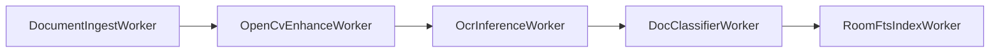

# Offline & Background Processing Architecture — LocalPDF

## Offline-First Architecture

LocalPDF is designed from the ground up as a standalone, zero-cloud, 100% offline application:
- Local database (Room + SQLite FTS5) is the authoritative source of truth.
- All AI, OCR, computer vision, and PDF operations execute on the device CPU/GPU/NPU without requiring network connectivity.
- No network blockers or internet connectivity checks for core app functionality.

## WorkManager Chained Batch Pipeline

For long-running, multi-page batch scanning or bulk PDF imports, work is orchestrated via Android Jetpack **WorkManager** using chained `CoroutineWorker` instances:

### Worker Roles & Idempotency

1. **`DocumentIngestWorker`**:
   - Copies source files to app-private storage, extracts raw page bitmaps from input PDF/camera buffer, and generates document records in Room.
2. **`OpenCvEnhanceWorker`**:
   - Performs batch cropping, perspective rectification, shadow removal, and contrast enhancement in `Dispatchers.Default`.
3. **`OcrInferenceWorker`**:
   - Runs ONNX Runtime PaddleOCR text detection and recognition across all pending pages. Emits live progress per page.
4. **`DocClassifierWorker`**:
   - Passes aggregated OCR text to the on-device ONNX classification model and regex entity extractor (extracting invoice totals, dates, vendor names).
5. **`RoomFtsIndexWorker`**:
   - Assembles final searchable PDF via PDFBox, inserts extracted tokens into the `doc_fts` SQLite FTS5 table, and completes the transaction.

## Foreground Service Support & UI Reactivity

- Long-running batch imports (10+ pages) promote the pipeline to a Foreground Service with an ongoing notification displaying progress (`"Processing page 4 of 12..."`).
- UI observes processing state reactively via `WorkManager.getWorkInfosByTagFlow("document_process_$id")` mapped directly to Compose UI state.

## Local Backup & Restore

- **Export**: Generates an encrypted ZIP package containing the Room database snapshot and document file store encrypted with a user-provided passphrase using AES-256.
- **Import**: Validates archive checksum, decrypts files into sandbox, applies database integrity check, and rebuilds the FTS5 index.
